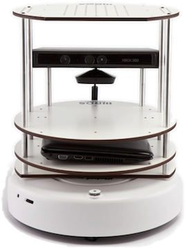
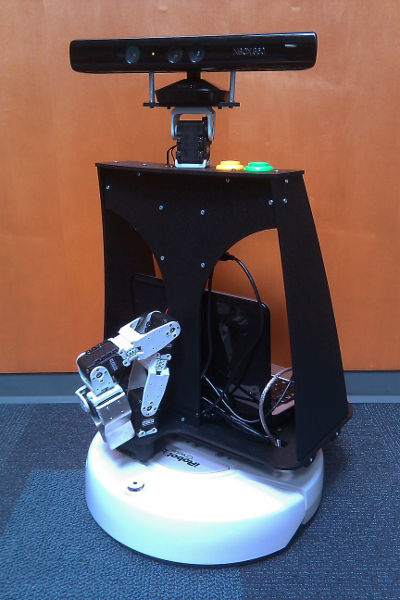
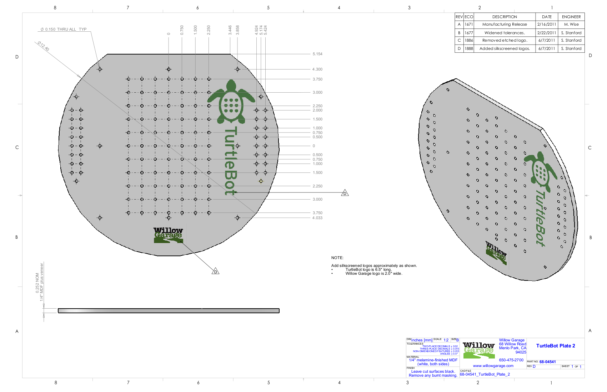
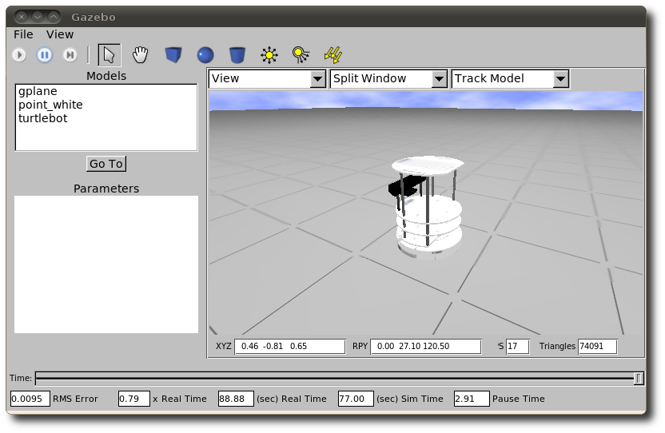

REP: 119
Title: Specification for TurtleBot Compatible Platforms
Author: Melonee Wise and Tully Foote
Status: Draft
Type: Standards Track
Content-Type: text/x-rst
Created: 5-Dec-2011
ROS-Version: Electric
Post-History: 

Abstract
========

This REP outlines compatibility defintions for TurtleBot compatible
platforms. The TurtleBot is a specific product, but it is an Open
Hardware Design released under the FreeBSD Documentation
License. [#oshw]_ [#freebsd-doc-license]_ The purpose of this document
is to differentiate the critical design features which are necessary
for compatability from the other design features which can be modified
without functionally effecting the core design. This document is meant
to be a guideline for the development of new cheaper or more
functional robots that can still leverage the development efforts of
the TurtleBot community. 

Motivation
==========

Developers of TurtleBot applications, hardware accessories, models,
and libraries need a share convention for compatibility in order to
better integrate and re-use software and hardware components. Shared
conventions for compatibility provides a specification for developers
creating new hardware configurations, and accessories for TurtleBot
compatible platforms. Similarly, developers creating libraries and
applications can more easily use their software with robots that are
compatible with this specification.  

It is expected that most tools and applications written for a
TurtleBot should run on a Level 1 compatible robot.

   
   A TurtleBot

The TurtleBot is trademarked by Willow Garage.  If you would like
information on producing TurtleBot branded product please contact
Willow Garage at turtlebotinfo@willowgarage.com . This document is
designed to allow others to develop robots which can take advantage of
the growing community around the TurtleBot design.

There are many tools and applications written for the TurtleBot
which can be useful for other similar robots.  Level 2 compatible
robots are a subset of these robots for which a majority of the applications
will work.  There are already a number of robots which are TurtleBot
compatible such as Mini Max [#minimax]_ and Pi Robot [#pirobot]_ .

   
   Mini Max the robot. 

TurtleBot Core Features
=======================

TurtleBot is a low-cost, open-source software and hardware personal
robotics kit. The TurtleBot main hardware features include a mobile
base, rgbd sensor, on board computation, wireless communication, and
expansion space for adding new hardware. 

Compatibility Specification
===========================

There are two levels of compatability defined in this REP.  Level 1
compatable robots are expected to be able to be swapped out without
significant code changes. Level 2 compatable robots are expected to be
able to share significant software components, but may require
non-trivial changes to software between robots.

Below are the specifications for each of the levels of compliance:

Level 1
-------

Robots that are level 1 compatible meet the following requirements as well as all Level 2 requirements.  

Hardware Requirements
'''''''''''''''''''''
The following hardware requirements are to ensure that the default
TurtleBot software runs without modification on the robot and to
ensure accessory compatibility between TurtleBot compatible robots. 

* The robot must have a rgbd camera with a base_link to
  camera_rgb_frame translation of [x:-0.087m, y:-0.005m, z:0.287m], as
  specified in the turtlebot.xacro file in the turtlebot_description
  package. 

* The top mounting surface of the robot must provide a hole grid pattern
  centered around the z-axis of the robot base_link that is identical to
  the 68-04541_TurtleBot_Plate_2 part found in the TurtleBot hardware
  documentation and shown in the figure below. 

* The top mounting surface of the robot must be 0.2032m (8 inches)
  from rgbd camera mounting surface.

* The robot fits within a a circle 0.35m in diameter 

* The robot must provide at least the following power buses:

  - 12V at 1.5A with a male Micro Fit 1x2 connector (Molex 43045-0209)
  - 5V at 500mA solderable connection (If connectorized use Micro Fit 2x1 connector (Molex 43650-0218) )

* Accurate Deadreckoning:

  * Drive pattern TODO with less than X inches offset and Y radians offset. 

   
   TurtleBot Mounting Surface. 

 
Software Requirements
'''''''''''''''''''''

The TurtleBot stacks (turtlebot, turtlebot_viz, turtlebot_apps, turtlebot_arm)
must run on the robot without user modification. 

Distributors of TurtleBot Level 1 compatible robots should provide the 
following software and configuration files if they are different than the 
TurtleBot:

* A node which implements the TurtleBot Node Core ROS API listed below.
* Provide equivilant diagnostics with turtlebot_node [#turtlebot_node]_
* Provide turtlebot.launch file to replace turtlebot_bringup/upstart/turtlebot.launch
* If the RGBD sensor requires a breaker to turn on it will use "Breaker 0"
* If an attached arm requires a breaker to turn on it will use "Breaker 1" 

TurtleBot Node Core API
'''''''''''''''''''''''

Subscribed Topics

    * cmd_vel (geometry_msgs/Twist)
       The desired velocity of the robot. The type of this message is determined by the drive_mode parameter. Default is geometry_msgs/Twist.

Published Topics

    * odom (nav_msgs/Odometry)
       The odometry of the robot based on the gyro and sensor_state.
    * imu/data (sensor_msgs/Imu)
       The angular velocity and integrated position of the gryo.

Expected Parameters

    * ~cmd_vel_timeout (double, default: 0.6)
       If a new command isn't received within this many seconds, the base is stopped.

Level 2
-------
Robots that are level 2 compatible meet the following requirements as
well as all the hardware extensions and modification requirements.  

Hardware Requirements
'''''''''''''''''''''

* An RGBD sensor

* A mobile robot base

* A computer capable of running ROS and processing the RGBD sensor at full frame rate.  

  - Note: most RGBD sensors require a full USB 2.0 bus to operate correctly, 
    thus most computers will require 2 USB busses if USB periferals are expected to be used. 

* Odometry is expected to be accurate within 1% after calibration in both linear and angular movement.  

Software Requiremets
''''''''''''''''''''

* URDF description of the robot

* The origin of the base_link is at the rotation point of an in-place turn. 

* The depth sensor should publish in the "camera" namespace

* The base moves based on `geometry_msgs/Twist`_ on the "cmd_vel"
  topic
  
  - If the base is not holonomic, only the components of the command which are achievable should be executed.

* The base publishes `nav_msgs/Odometry`_ on the "odom" topic

* REP 105 [#REP-105]_ compliant

Hardware Extensions and Modifications
-------------------------------------

When adding or creating new hardware for TurtleBot compliant robots
distributors should use the following guidelines and conventions:

Location Naming Conventions
'''''''''''''''''''''''''''
Location names should be generic and have semantic meaning with
respect to the robot hardware, below are examples of common location
names:

* base
* torso
* head
* arm

  - shoulder
  - upper_arm
  - elbow
  - forearm
  - wrist
  - gripper

Sensor Naming Convetions
''''''''''''''''''''''''
Whenever possible it is prefered to use the following convention
naming for sensor topics/namespaces LOCATION_TYPE. For example:

* base_scan
* head_camera
* forearm_camera
 
Link, Joint, and Frame Naming Conventions
'''''''''''''''''''''''''''''''''''''''''
Whenever possible it is prefered to use the following convention
naming for links and connecting joints LOCATION_DESCRIPTOR_TYPE. For example:

Common Joint Descriptors are: 

* flex
* lift
* pan
* roll
* tilt

Examples are: 

* arm_shoulder_pan_link, arm_shoulder_pan_joint
* head_tilt_link, head_tilt_joint
* forearm_link, elbow_flex_joint

Whenever possible it is prefered to use the following convention
naming for links and sensors LOCATION_SENSOR_TYPE. For example:

* head_camera_rgb_link, head_camera_rgb_optical_frame

URDF
''''
When providing an accessory or extension for a Level 1 or 2 TurtleBot
compatable robot a URDF description of the extension should be
provided which provides at least collision geometries and visualization meshes.

Simulation
==========

There is a package which provides the necessary Gazebo model for
Level 1 compliant robots.  See the turtlebot_simulator stack
[#turtlebot_simulator]_ for more information.

It is recommended for Level 2 compliant robots to release a stack with
the gazebo model(s) which allows them to be simulated as well, to ease
development for developers who do not always have access to hardware.

   The TurtleBot simulated in Gazebo

Exceptions
==========

The scope of potential robotics software is too broad to require all
ROS software to follow the guidelines of this REP.  However, choosing
different conventions should be well justified and well documented.

Existing REP Compliance
=======================

This REP is built upon previous REPs and ROS best practices. All implementations should do the same.  Specifically relevant ones are listed below.  

REP 103 [#REP-103]_ Standard Units of Measure and Coordinate Conventions 
    All units will follow REP 103 and all cooridnate frames will follow the conventions in REP 103. 

REP 105 [#REP-105]_ Coordinate Frames for Mobile Platforms 
    The coordinate frames for the mobile base will follow REP 105. 

REP 107 [#REP-107]_ Diagnostic System for Robots Running ROS
    All hardware drivers should provide diagnostic information via the diagnostic_msgs interface of REP 107.

References
==========

.. [#REP-103] REP 103, Standard Units of Measure and Coordinate Conventions
   (http://www.ros.org/reps/rep-0103.html)
.. [#REP-105] REP 105, Coordinate Frames for Mobile Platforms
   (http://www.ros.org/reps/rep-0105.html)
.. [#REP-107] REP 107, Diagnostic System for Robots Running ROS
   (http://www.ros.org/reps/rep-0107.html)
.. [#REP-10?] REP 10?, Camera Frame Naming Conventions
   (http://www.ros.org/reps/rep-0107.html)
.. [#turtlebot_simulator] The turtlebot_simulator stack
   (http://www.ros.org/wiki/turtlebot_simulator)
.. [#turtlebot_node] The turtlebot_node package
   (http://www.ros.org/wiki/turtlebot_node)
.. [#minimax] The Mini Max Robot
   (http://www.showusyoursensors.com/2011/06/introducing-mini-maxwell.html)
.. [#pirobot] The Pi Robot
   (http://www.pirobot.org/)
.. [#oshw] The Open Source Hardware Statement and Definition
   (http://freedomdefined.org/OSHW)
.. [#freebsd-doc-license] The FreeBSD Documentation License
   (http://www.freebsd.org/copyright/freebsd-doc-license.html)
.. _geometry_msgs/Twist:
   http://www.ros.org/doc/api/geometry_msgs/html/msg/Twist.html
.. _nav_msgs/Odometry:
   http://www.ros.org/doc/api/nav_msgs/html/msg/Odometry.html

Trademarks
==========

TurtleBot is a trademark of Willow Garage.  

Copyright
=========

This document has been placed in the public domain.
