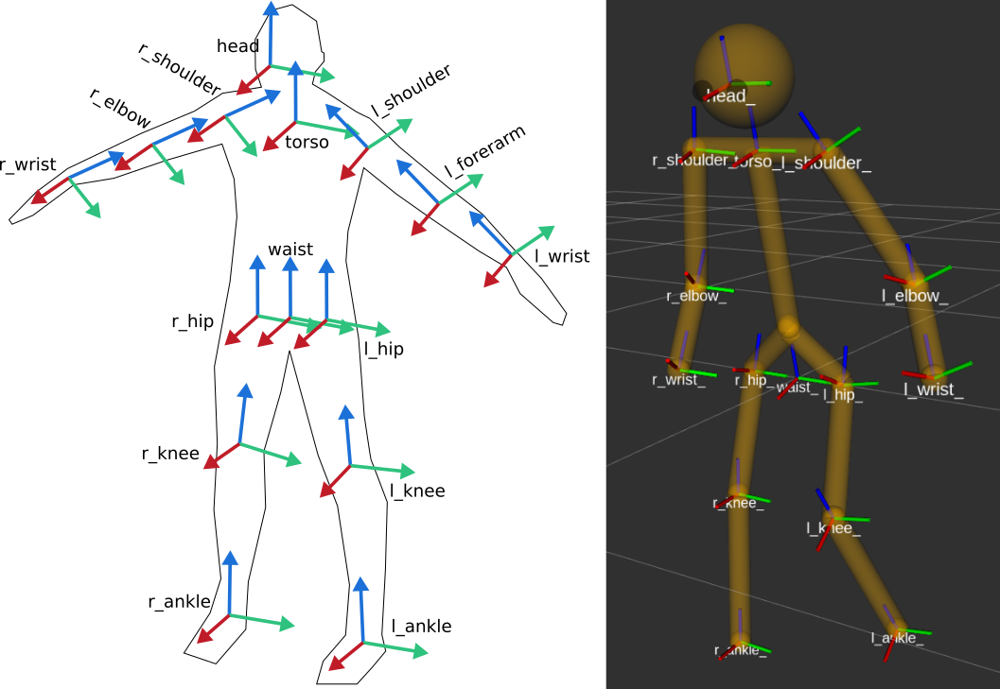

REP: 155
Title: Conventions, Topics, Interfaces for Perception in Human-Robot Interaction
Author: Séverin Lemaignan <severin.lemaignan@pal-robotics.com>
Status: Draft
Type: Informational
Content-Type: text/x-rst
Created: 11-Jan-2022

Abstract
========

This REP provides a set of conventions and common interfaces for Human-Robot
Interaction (HRI) scenarios, with a focus on the perception of humans and social
signals.
It aims at enabling interoperability and reusability of core
functionality between the many HRI-related software tools, from skeleton
tracking, to face recognition, to natural language processing.

Besides, these interfaces are designed to be relevant for a broad range of HRI
situations, from crowd simulation, to kineastetic teaching, to social
interaction.

Specifically, this REP covers:

- human modeling, as a combination of a permanent identity (person) and
  transient parts that are intermittently detected (eg face, skeleton, voice);
- topic naming conventions under the ``/humans/`` topic namespace;
- human kinematic modeling (based on dynamically generated URDF models), as
  well as 3D TF frame conventions (naming, orientation);
- representation of group interactions (groups, mutual gaze)

Rationale
=========

ROS is widely used in the context of human-robot interactions (HRI).
However, to date, no single effort (e.g. [1]_ [2]_) has been successful at
coming up with broadly accepted interfaces and pipelines for that domain, as
found in other parts of the ROS ecosystem (for manipulation or 2D navigation for
instance).
As a result, many different implementations of common tasks (skeleton tracking,
face recognition, speech processing, etc) cohabit, and while they achieve
similar goals, they are not generally compatible, hampering the code
reusability, experiment replicability, and general sharing of knowledge.

In order to address this issue, this REP aims at structuring the whole "ROS for
HRI" space by creating an adequate set of ROS messages and services to describe
the software interactions relevant to the HRI domain, as well as a set of
conventions (eg topics structure, tf frames) to expose human-related
information.

The REP aims at modeling these interfaces based on existing, state-of-the-art
algorithms relevant to HRI perception, while considering the broad range of
application scenario in HRI.

It is hoped that such an effort will allow easier collaboration between
projects and allow a reduction in duplicate efforts to implement the same
functionality.

Overview
========

This REP specifies multiple aspects of human-robot interaction, with a primary
focus on human perception/social signal recognition.

It is split into 4 sections:

1. human representation, as a combination of a permanent identity (*person*)
   and transient parts that are intermittently detected (e.g. *face*,
   *skeleton*, *voice*);
2. topic naming conventions under the ``/humans/`` topic namespace;
3. kinematic model of the human and 3D tf frame conventions (naming,
   orientation, compatible with REP-120 [3]_ where possible) 
4. representation of group interactions (groups, mutual gaze) 

By following the naming conventions and leveraging the interfaces defined in
this REP, both tools and libraries can be designed to be reusable between
different frameworks and experiments.

.. note:: Importantly, the REP does not mandate specific tools or algorithms to
   perform human perception/social signal recognition per se.  It only specify
   naming conventions and interfaces between these nodes.

The use of capitalized words such as MUST, SHOULD, MAY must be understood as
specified in the IETF RFC2119 'Key words for use in RFCs to Indicate Requirement
Levels' [6]_.

Human Representation
====================

To accommodate existing tools and techniques used to detect and recognise
humans, the representation of a person is built on a combination of 4
unique identifiers (UUIDs): a **person identifier**, a **face identifier**, a
**body identifier** and a **voice identifier**.
Future revisions of this REP might add additional identifiers.

These four identifiers are not mutually exclusive, and depending on the
requirements of the application, the available sensing capabilities, and the
position/behaviour of the humans, only some might be available for a given
person, at a given time.

Person Identifier
-----------------

The **person identifier** MUST be a unique ID (typically, a UUID) permanently
associated with a unique person.
This person ID is normally assigned by a node able to perform person
identification (face recognition node, voice recognition node, sound source
localisation + name, identification based on physical features like
height/age/gender, person identification based on pre-defined features like the
colour of the clothes, etc.)
This ID is meant to be **persistent** so that the robot can recognize people
across encounters/sessions.
Nodes providing person IDs MAY serialise these IDs to a permanent storage, for
them to persist across robot reboots.

When meaningful (see section `Person frame`_), a TF frame MUST be
associated to the person ID and named ``person_<personID>``.
Due to the importance of the head in human-robot interaction, the
``person_<personID>`` frame is expected to be placed as close as possible to the
head of the human.
If neither the face nor the skeleton are tracked, the ``person_<personID>``
frame might be located to the last known position of the human, or removed
altogether if no meaningful estimate of the human location is available.
See section `Person frame`_ for details regarding the ``person_<personID>``
frame.

At any given time, the list of currently-seen persons is published under the
``/humans/persons/tracked`` topic as ``hri_msgs/IdsList`` messages, and the list
of all known persons (ie, persons that have been seen and recognized at least
once in the past) under ``/humans/persons/known``.

Merging Person Identifiers
''''''''''''''''''''''''''

In certain cases, two person IDs must be merged (for instance, the robot
detects that a voice and a face that were thought to belong to different people
are indeed the same person).

In such a case, one of the person IDs is marked as an *alias* of the other
person, by publishing the ID of the other person on a special subtopic named
``alias``.
See section `Topics structure`_ for details.

.. note:: The reverse operation (splitting a person into two) can be realised
   by simply publishing a second person ID.

Anonymous persons
'''''''''''''''''

While person IDs are generally expected to be permanent, one exception exists
for persons that the robot has detected but not yet identified.

For instance, the robot hears a voice, and therefore knows that a person is
around, but no voice identification nodes is available -- or the voice
identification has not yet recognised the voice. In such a case, an *anonymous
person* MAY be created, ie a person who has not yet been assigned a permanent
ID.

*Anonymous persons* are treated like regular persons.
They however publish a latched ``true`` boolean on their ``/anonymous``
subtopic, and their ID is not guaranteed to be permanent (it can in fact
change/be removed at any point).

Face Identifier
---------------

The **face identifier** MUST be a unique ID that identifies a detected face.
This ID is typically generated by the face detector/head pose estimator upon
face detection.

Importantly, **this ID is not persistent**: once a face is lost (for instance,
the person goes out of frame), its ID is not valid nor meaningful anymore.
To cater for a broad range of applications (where re-identification might not be
always necessary), there is no expectation that the face detector will attempt
to recognise the face and re-assign the same face ID if the person reappears.

.. note:: A face detector/face tracker MAY reuse the same face ID if it is 
   confident that the face is indeed the same.

There is a one-to-one relationship between this face ID and the estimated 6D
pose of the head. If the node publishes a head pose estimation, the ROS TF frame
MUST be named ``face_<faceID>`` (see section `Face and Gaze Frames`_ for the
face frame conventions).

At any given time, the list of tracked faces SHOULD be published under the
``/humans/faces/tracked`` topic as ``hri_msgs/IdsList`` messages.

Body Identifier
---------------

Similarly to the face identifier, the **body identifier** MUST be a unique ID,
associated to a person’s skeleton.
It is normally created by a skeleton tracker upon detection of a skeleton.

Like the face ID, **the body ID is not persistent**, and is valid only as long
as the specific skeleton is tracked by the skeleton tracker which initially
detected it.

The corresponding TF frame is ``body_<bodyID>``, and TF frames associated with
each of the body parts of the person, MUST suffixed with the same ID (see
section `Body frames`_).

At any given time, the list of tracked bodies SHOULD be published under the
``/humans/bodies/tracked`` topic as ``hri_msgs/IdsList`` messages.

Voice Identifier
----------------

Likewise, a speech separation node MUST assign a unique, non-persistent, ID
for each detected voice.
Tracked voices SHOULD be published under the ``/humans/voices/tracked`` topic as
``hri_msgs/IdsList`` messages.

Identifier Matching
-------------------

Associations between IDs (for instance to denote that a given voice belongs to
a given person, or a given face to a given body) are expressed by publishing
``hri_msgs/IdsMatch`` messages on the ``/humans/candidate_matches`` topic.
The ``hri_msgs/IdsMatch`` message MAY include a confidence level.

A typical implementation will have several specialised nodes publishing
candidate matches on ``/humans/candidate_matches`` (e.g. a face recognition node
providing matches between faces and persons; a voice recognition node providing
matches between voices and persons) and one 'person manager' node collecting
the candidates, and publishing the most likely associations between a person ID
and its face/body/voice IDs under the ``/humans/persons/`` namespace.

Special case for anonymous persons
''''''''''''''''''''''''''''''''''

A node that wants to advertise that a person exists, but is not identified yet
("anonymous person") SHOULD publish a ``hri_msgs/IdsMatch`` message on the
``/humans/candidate_matches`` topic with only one specified id.
For instance, a simple face *detector* (ie, not performing face identification)
can published a message like:

.. code:: python

  {face_id: 'ff424', body_id: '', voice_id: '', person_id: '' confidence: 0.0, }

to indicate that the face ``ff424`` has been detected, and thus, a corresponding
person must exist.
That person will be published as ``anonymous``, and that message will have lower
precedence than another message that associates that face to a recognised person.
Note that in that case, the confidence MUST be ignored.

Identifier Syntax
-----------------

Identifiers can be arbitrary, as long as they are unique.
It is also recommended to keep them short to avoid clutter.

Note that using people’s names as identifier is possible, but not
generally recommended as collisions are likely.

Common Parameters
=================

- ``/humans/faces/width`` (default: 128): width in pixels of the cropped faces
  published under ``/humans/faces/XYZ/cropped``, ``/humans/faces/XYZ/aligned``
  and ``/humans/faces/XYZ/frontalized``
- ``/humans/faces/height`` (default: 128): height in pixels of the cropped
  faces published under ``/humans/faces/XYZ/cropped``,
  ``/humans/faces/XYZ/aligned`` and ``/humans/faces/XYZ/frontalized``
- ``/human_description_<bodyID>``: URDF models of detected humans.
  See Section `Kinematic Model of the Human`_ for details.
- ``/human/match_threshold`` (``float``, default: 0.5): the minimum level of
  likelihood to consider a face/body/voice to belong to a given person.
- ``/humans/reference_frame`` (``string``, default: `map`): persons' TF frames
  must be published with respect to `reference_frame`.
  Typically, faces/bodies/voices frames are published wrt to their respective
  sensors frame.  `reference_frame` is usually a 'static' frame (eg `map`), so
  that if the person moves out of view of the robot (and therefore, its position
  can not be updated anymore), it 'stays' where it was last seen.

Topics Structure
================

A system implementing this REP MUST follow the following conventions
for all HRI-related topics:

1. all topics are grouped under the global namespace ``/humans/``
2. five sub-namespaces are available:

  - ``/humans/faces``
  - ``/humans/bodies``
  - ``/humans/voices``
  - ``/humans/persons``
  - ``/humans/interactions``

3. the first four (``/faces``, ``/bodies``, ``/voices``, ``/persons``) expose
   one sub-namespace per face, body, voice, person detected, named after the
   corresponding ID (for instance, ``/humans/faces/bd34a/``).
   In addition, they expose a topic ``/tracked`` (of type ``hri_msgs/IdsList``)
   where the list of currently tracked faces/bodies/voices/persons is published;
4. matches between faces/bodies/voices/persons are published on the 
   ``/humans/candidate_matches`` topic, as explained in Section `Identifier
   matching`_;
5. the ``/humans/interactions`` topic exposes group-
   level signals, including gazing patterns and social
   groups.

.. note:: the ``hri_msgs`` messages are defined in the `hri_msgs
   <https://github.com/ros4hri/hri_msgs>`_ repository.

.. note:: The slightly unconvential structure of topics (with one namespace per
   face, body, person, etc.) enables modular pipelines.

   For instance, a face detector might publish cropped images of detected faces
   under ``/humans/faces/face_1/cropped``, ``/humans/faces/face_2/cropped``,
   etc.

   Then, depending on the application, an additional facial expression
   recognizer might be needed as well.
   For each detected face, that node would subscribe to the corresponding
   `/cropped` topic and publish its results under
   ``/humans/faces/face_1/expression``, ``/humans/faces/face_2/expression``,
   etc., augmenting the available information about each face in a modular way.

   Such modularity would not be easily possible if we had chosen to publish
   instead a generic ``Face`` message, as a single node would have had first to
   fuse all possible information about faces.

   See the `Illustrative Example`_ below for a complete example.

.. note:: `libhri <https://github.com/ros4hri/libhri>`_ can be used to hide away
   the complexity of tracking new persons/faces/bodies/voices. It automatically
   handles subscribing/unsubcribing to the right topics when new
   persons/faces/bodies/voices are detected.

Faces
-----

The list of currently detected faces (list of face IDs) is published
under ``/humans/faces/tracked`` (as a ``hri_msgs/IdsList`` message).

For each detected face, a namespace ``/humans/faces/<faceID>/`` is
created (eg ``/humans/faces/bf3d/``).

The following subtopics MAY then be available, depending on available
detectors:

=================== ==================================== ======== ========================
Name                Message type                         Required Description
=================== ==================================== ======== ========================
``/roi``            ``sensor_msgs/RegionOfInterest``        x     Region of the face in
                                                                  the source image
``/cropped``        ``sensor_msgs/Image``                   x     Cropped face image, if 
                                                                  necessary scaled, 
                                                                  centered and 0-padded 
                                                                  to match the
                                                                  ``/humans/faces/width``
                                                                  and
                                                                  ``/humans/faces/height``
                                                                  ROS parameters
``/aligned``         ``sensor_msgs/Image``                        Aligned (eg, the two 
                                                                  eyes are horizontally 
                                                                  aligned) version of the
                                                                  cropped face, with same 
                                                                  resolution as
                                                                  ``/cropped``
``/frontalized``     ``sensor_msgs/Image``                        Frontalized version of
                                                                  the cropped face, with
                                                                  same resolution as
                                                                  ``/cropped``
``/landmarks``      ``hri_msgs/FacialLandmarks``                  2D facial landmarks
                                                                  extracted from the face
``/facs``           ``hri_msgs/FacialActionUnits``                The presence and
                                                                  intensity of facial
                                                                  action units found in 
                                                                  the face
``/expression``     ``hri_msgs/Expression``                       The expression
                                                                  recognised from the
                                                                  face
``/softbiometrics`` ``hri_msgs/SoftBiometrics``                   Detected age and gender
                                                                  of the person
=================== ==================================== ======== ========================

Bodies
------

The list of currently detected bodies (list of body IDs) is published
under ``/humans/bodies/tracked`` (as a ``hri_msgs/IdsList`` message).

For each detected body, a namespace ``/humans/bodies/<bodyID>/`` is
created.
The following subtopics MAY then be available, depending on available
detectors:

================= ==================================== ======== ========================
Name              Message type                         Required Description
================= ==================================== ======== ========================
``/roi``          ``sensor_msgs/RegionOfInterest``        x     Region of the whole body
                                                                body in the source image
``/cropped``      ``sensor_msgs/Image``                   x     Cropped body image
``/skeleton2d``   ``hri_msgs/Skeleton2D``                       The 2D points of the
                                                                the detected skeleton
``/joint_states`` ``sensor_msgs/JointState``                    The joint state of the 
                                                                human body, following
                                                                the `Kinematic Model 
                                                                of the Human`_
``/posture``      ``hri_msgs/BodyPosture``                      Recognised body posture
                                                                (eg standing, sitting)
``/gesture``      ``hri_msgs/Gesture``                          Recognised symbolic 
                                                                gesture (eg waving)
================= ==================================== ======== ========================

3D body poses SHOULD be exposed via TF frames.
This is discussed in
Section `Kinematic Model and Coordinate Frames`_.

Voices
------

The list of currently detected voices (list of voice IDs) is published
under ``/humans/voices/tracked`` (as a ``hri_msgs/IdsList`` message).

For each detected voice, a namespace ``/humans/voices/<voiceID>/`` is
created.

The following subtopics MAY then be available, depending on available
detectors:

================ ==================================== ======== ========================
Name             Message type                         Required Description
================ ==================================== ======== ========================
``/audio``       ``audio_common_msgs/AudioData``         x     Separated audio stream
                                                               for this voice
``/features``    ``hri_msgs/AudioFeatures``                    INTERSPEECH’09 Emotion
                                                               challenge [4]_
                                                               low-level audio features
``/is_speaking`` ``std_msgs/Bool``                             Whether or not speech is 
                                                               recognised from this 
                                                               voice
``/speech``      ``hri_msgs/LiveSpeech``                       The live stream of speech
                                                               recognized via an ASR
                                                               engine
================ ==================================== ======== ========================

Persons
-------

The list of currently tracked persons (list of person IDs) is published
under ``/humans/persons/tracked`` (as a ``hri_msgs/IdsList`` message).

The list of known persons (either actively tracked, or known but not tracked
anymore) is published under ``/humans/persons/known`` (as a ``hri_msgs/IdsList``
message).

For each detected person, a namespace ``/humans/persons/<personID>/`` is
created.

The following subtopics MAY then be available, depending on available
detectors, and whether or not the person has yet been matched to a face/body/voice:

======================== ==================================== ======== ========================
Name                     Message type                         Required Description
======================== ==================================== ======== ========================
``/anonymous``           ``std_msgs/Bool``                     x       If true, the person is
                         (latched)                                     *anonymous*, ie has
                                                                       not yet been identified,
                                                                       and has not been issued
                                                                       a permanent ID
``/face_id``             ``std_msgs/String``                           Face matched to that
                         (latched)                                     person (if any)
``/body_id``             ``std_msgs/String``                           Body matched to that
                         (latched)                                     person (if any)
``/voice_id``            ``std_msgs/String``                           Voice matched to that
                         (latched)                                     person (if any)
``/alias``               ``std_msgs/String``                           If this person has been
                         (latched)                                     merged with another, 
                                                                       this topic contains the
                                                                       person ID of the new 
                                                                       person
``/engagement_status``   ``hri_msgs/EngagementLevel``                  Engagement status of the
                                                                       person with the robot
``/location_confidence`` ``std_msgs/Float32``                          Location confidence; 1
                                                                       means *person currently
                                                                       seen*, 0 means *person
                                                                       location unknown*. See
                                                                       `Person Frame`_
``/name``                ``std_msgs/String``                           Name, if known
``/native_language``     ``std_msgs/String``                           IETF language codes like
                                                                       EN_gb, if known
======================== ==================================== ======== ========================

Interactions
------------

Finally, the namespace ``/humans/interactions`` exposes topics where group-level
interactions are published when detected.

=========== ============================== ===========================
Name        Message type                   Description
=========== ============================== ===========================
``/groups`` ``hri_msgs/Group``             Estimated social groups
``/gazing`` ``hri_msgs/Gaze``              Estimated gazing behaviours
=========== ============================== ===========================

See section `Group-level Interactions`_ for details.

Illustrative Example
--------------------

You run a node ``your_face_detector_node``.
This node detects two faces, and
publishes the corresponding regions of interest and cropped faces.
The node
effectively advertises and publishes onto the following topics:

.. code::

   > rostopic list
   /humans/faces/23bd5/roi     # sensor_msgs/RegionOfInterest
   /humans/faces/23bd5/cropped # sensor_msgs/Image
   /humans/faces/b092e/roi     # sensor_msgs/RegionOfInterest
   /humans/faces/b092e/cropped # sensor_msgs/Image

.. note:: The IDs (in this example, ``23bd5`` and ``b092e``) are arbitrary, as
   long as they are unique.
   However, for practical reasons, it is recommended to keep them reasonably
   short.

You start an additional node to recognise expressions:
``your_expression_classifier_node``.
The node subscribes to the
``/humans/faces/<faceID>/cropped`` topics and publishes expressions for each
faces under the same namespace:

.. code::

   > rostopic list
   /humans/faces/23bd5/roi
   /humans/faces/23bd5/cropped
   /humans/faces/23bd5/expression # hri_msgs/Expression
   /humans/faces/b092e/roi
   /humans/faces/b092e/cropped
   /humans/faces/b092e/expression # hri_msgs/Expression

You then launch ``your_body_tracker_node``.
It detects one body:

.. code::

   > rostopic list
   /humans/faces/23bd5/...
   /humans/faces/b092e/...
   /humans/bodies/67dd1/roi     # sensor_msgs/RegionOfInterest
   /humans/bodies/67dd1/cropped # sensor_msgs/Image

In addition, you start a 2D/3D pose estimator ``your_skeleton_estimator_node``.
The 2D skeleton can be published under the same body namespace, and the 3D
skeleton is published as a joint state.
The joint state can then be converted
into TF frames using eg a URDF model of the human, alongside a
``robot_state_publisher``:

.. code::

   > rostopic list
   /humans/faces/23bd5/...
   /humans/faces/b092e/...
   /humans/bodies/67dd1/roi
   /humans/bodies/67dd1/cropped
   /humans/bodies/67dd1/skeleton2d # hri_msgs/Skeleton2D
   /humans/bodies/67dd1/joint_states # sensor_msgs/JointState

   > xacro ws/human_description/urdf/human-tpl.xacro id:=67dd1 height:=1.7 > body-67dd1.urdf
   > rosparam set human_description_67dd1 -t body-67dd1.urdf
   > rosrun robot_state_publisher robot_state_publisher joint_states:=/humans/bodies/67dd1/joint_states robot_description:=human_description_67dd1

.. note:: In this example, we manually generate the URDF model of the human,
   load it to the ROS parameter server, and start a ``robot_state_publisher``.
   In practice, this should be done programmatically everytime a new body is
   detected.

So far, faces and bodies are detected, but they are not yet 'unified' as a
person.

First, we need a stable way to associate a face to a person.
This would typically require a node for facial recognition.  Such a node would
subscribe to each of the detected faces' ``/cropped`` subtopics, and publish
*candidate matches* on the ``/humans/candidate_matches`` topic, using a
``hri_msgs/IdsMatch`` message.
For instance:

.. code::

  > rostopic echo /humans/candidate_matches
  face_id: "23bd5"
  body_id: ''
  voice_id: ''
  person_id: "76c0c"
  confidence: 0.73
  ---

In that example, the person ID ``76c0c`` is created and assigned by the face
recognition node itself.

Finally, you would need a ``your_person_manager_node`` to publish the
``/humans/persons/76c0c/`` subtopics based on the candidate matches:

.. code::

   > rostopic list
   /humans/faces/23bd5/...
   /humans/faces/b092e/...
   /humans/bodies/67dd1/...
   /humans/persons/76c0c/face_id

In this simple example, only the ``/face_id`` subtopic would be advertised (with a
latched message pointing to the face ID ``23bd5``).
In practice, additional
information could be gathered by the ``your_person_manager_node`` to expose eg
soft biometrics, engagement, etc.
Similarly, the association between the person
and its body would have to be performed by a dedicated node.

Overall, six independent nodes are combined to implement this pipeline:

.. raw:: html
  
  

  graph TD
    img(<em>image</em>)
    FR[<tt>your_face_recognizer_node</tt>]
    PE[<tt>your_skeleton_estimator_node</tt>]
    BT[<tt>your_body_tracker_node</tt>]
    EC[<tt>your_expression_classifier_node</tt>]
    FD[<tt>your_face_detector_node</tt>]
    PM[<tt>your_person_manager_node</tt>]
    img --> FD
    img --> BT
    FD --> EC
    FD --> FR
    FR --> PM
    BT --> PE
  

This possible pipeline is only for illustration purposes: depending on each
specific pipeline implementations, some of these nodes might be merged or on
the contrary, further divided into smaller nodes.
For instance, one might
choose to integrate together the face recogniser node and the person manager.

Note as well that, in order to build a complete perception pipeline for HRI,
additional nodes would be needed, for instance for voice processing.

Kinematic Model and Coordinate Frames
=====================================

Where meaningful, the coordinate frames used for humans follow the
conventions set out in REP-120 [3]_.

These conventions also follow the REP-103 [5]_.

Kinematic Model of the Human
----------------------------

        rendered in rviz)

The main 15 links defined on the human body are presented in the above diagram.
Frames orientations and naming are based on REP-103 and REP-120.
Right: render of the reference URDF model of the human body in `rviz`.

The following diagram presents all the link (boxes) and joints (arrows) in the
recommended human kinematic model. 

.. raw:: html
  
  

  graph TD
    B[body] -->|waist| W[waist]
    W --> |"torso [fixed]"| T[torso]

    T -->|r_head| D[r_head]
    D -->|y_head| E[y_head]
    E -->|p_head| F[p_head]
    F -->|"head [fixed]"| G[head]

    T -->|l_y_shoulder| SLY[l_y_shoulder]
    SLY -->|l_p_shoulder| SLP[l_p_shoulder]
    SLP -->|l_r_shoulder| SL[l_shoulder]
    SL -->|l_elbow| EL[l_elbow]
    EL -->|"l_wrist [fixed]"| WL[l_wrist]

    T -->|r_y_shoulder| SRY[r_y_shoulder]
    SRY -->|r_p_shoulder| SRP[r_p_shoulder]
    SRP -->|r_r_shoulder| SR[r_shoulder]
    SR -->|r_elbow| ER[r_elbow]
    ER -->|"r_wrist [fixed]"| WR[r_wrist]  

    B -->|l_y_hip| HLY[l_y_hip]
    HLY -->|l_p_hip| HLP[l_p_hip]
    HLP -->|l_r_hip| HL[l_hip]
    HL -->|l_knee| KL[l_knee]
    KL -->|"l_ankle [fixed]"| AL[l_ankle]

    B -->|r_y_hip| HRY[r_y_hip]
    HRY -->|r_p_hip| HRP[r_p_hip]
    HRP -->|r_r_hip| HR[r_hip]
    HR -->|r_knee| KR[r_knee]
    KR -->|"r_ankle [fixed]"| AR[r_ankle]
  

In practice, each of these links and joints must be suffixed with the
corresponding ``<bodyID>``, as several skeletons might be present at the same
time.

A parametric URDF model of humans is available in the ``human_description``
package.
It SHOULD be used to instantiate at run-time new human URDF model,
adjusted for the e.g. height of the detected persons.
The person's joint state
(published under ``/humans/bodies/<bodyID>/joint_states``) can then be used with
eg a `robot_state_publisher node <http://wiki.ros.org/robot_state_publisher>` to
publish the body's TF frames.

When generated, the URDF models of the humans should be loaded on the ROS
parameter server under ``/human_description_<bodyID>``.

.. note:: the `human_description
   <https://github.com/ros4hri/human_description>`_ ROS package contains a launch
   script ``visualize.launch`` that can be used to quickly experiment with the
   kinematic model of humans.

Face and Gaze Frames
--------------------

-  Head pose estimation nodes MUST publish the head 6D pose as
   a TF frame named ``face_<faceID>`` where ``<faceID>`` stands for the
   unique face identifier.
-  the parent of this frame is the sensor frame used to estimate the
   face pose.
-  The origin of the frame must be the sellion (defined as the deepest
   midline point of the angle formed between the nose and forehead.
   It can generally be approximated to the mid point of line connecting the two
   eyes).
-  The ``x`` axis is expected to point forward (ie, out of the face),
   the ``z`` axis is expected to point toward the scalp (ie, up when the
   person is standing vertically).
-  Any other facial landmark published as a TF frame must be parented to
   the head TF frame.
   It should be suffixed with the same ``_<faceID>``.

In addition, the person's gaze direction MUST be published as a
``gaze_<faceID>`` frame, collocated with the ``face_<faceID>`` frame, and with
its ``z`` axis aligned with the estimated gaze vector, ``x`` right, and ``y``
down ('optical frame' convention).

If gaze is not estimated beyond general head orientation, the
``gaze_<faceID>``'s ``z`` axis will be colinear with the ``face_<faceID>``'s
``x`` axis.

Finally, nodes performing attention estimation MAY publish a frame
``focus_<faceID>`` representing the estimated focus of attention of the person.

Body Frames
-----------

-  The body frame is named ``body_<bodyID>`` where ``<bodyID>`` stands
   for the unique skeleton identifier.
-  The origin of the frame is located at the mid point of the line
   connecting the hips.
-  the parent of this frame is the sensor frame used to estimate the
   body pose.
-  The ``x`` axis is expected to point forward (ie, out of the body),
   the ``z`` axis is expected to point toward the head (ie, up when the
   person is standing vertically).
-  The other skeleton points published as TF frames must be parented to
   the root ``body_<bodyID>`` frame, and all be suffixed with the same
   ``_<bodyID>``.
   Section  `Kinematic Model of the Human`_ lists the recommended names of body
   links and body joints.
-  if the skeleton tracker provide an estimate of the head pose, it
   might publish a frame named ``head_<bodyID>``. *It is the joint
   responsibility of the face tracker and skeleton tracker to ensure
   that* ``face_<faceID>`` *and* ``head_<bodyID>`` *are consistent with
   each other*.

Voice Frame
-----------

- Sound source localisation algorithms can broadcast estimated TF frames for
  detected voices.
  These frames should be named ``voice_<voiceID>``.
- The orientation of the frame is meaningless, and should be ignored.

Person Frame
------------

The ``person_<personID>`` frame has a slightly more complex semantic and
must be interpreted in conjunction with the person's ``location_confidence``
value (see `Persons`_ topics).

We can distinguish three cases:

1. The human is currently being tracked (ie ``personID`` is set, and at
   least one of ``faceID`` or ``bodyID`` is set).
   In this case, ``location_confidence`` MUST be set to 1 and:

  -  when a face ID is also defined, the ``person_<personID>`` frame must
     be collocated with the ``face_<faceID>`` frame.
  -  when a body ID is defined (ie the skeleton is being tracked), the
     ``person_<personID>`` frame must be collocated with the skeleton
     frame the closest to the head.
  -  if both the face and body IDs are defined, the ``person_<personID>``
     frame must be collocated with the ``face_<faceID>`` frame.

2. The human is not seen, but has been previously seen.  In this case,
   ``location_confidence`` MUST be set to a value ``< 1`` and a
   ``person_<personID>`` TF frame MUST be published **as long as**
   ``location_confidence > 0``.
   Simple implementations might choose to set ``location_confidence = 0.5`` as
   soon as the person is not actively seen anymore, continuously broadcast the
   last known location.
   More advanced implementations might slowly decrease ``location_confidence``
   over time to represent the fact that the human might have walked away, for
   instance.

3. The human is known, but has never been seen before.
   In this case, ``location_confidence`` MUST be set to ``0``, and no TF frame
   should be broadcast.

Group-level Interactions
========================

Representation of Groups
------------------------

When detected, group-level interactions are published on the
``/humans/interactions/groups``, using the ``hri_msgs/Group.msg`` message
type.

Each group is defined by a unique group ID, and a list of person IDs.
(groups can only be defined between persons).

Representation of gazing behaviours
-----------------------------------

Social gazing (eg, gazing between people) is represented as
``hri_msgs/Gaze.msg`` messages, published on the
``/humans/interactions/gazing`` topic.

Each ``Gaze.msg`` messages contain a *sender* and a *receiver* that MUST be
known persons.
Note that the relationship is not symmetrical: "A gazes at B" does not imply "B
gazes at A".
As such, *mutual gaze* will lead to two messages being published.

If one or the other of the sender and receiver IDs are not set, the robot is
assumed to respectively originate or be the target of the gaze.

Nodes publishing gazing information are expected to continuously publish
gaze messages, until the person is not gazing at the target anymore.

References
==========

.. [1] ``people`` package, last commit in 2015
   (https://github.com/wg-perception/people)

.. [2] ``cob_people_perception`` package, mainly developed between 2012 and
   2014 (https://github.com/ipa320/cob_people_perception)

.. [3] REP 120, Coordinate Frames for Humanoid Robots
   (https://ros.org/reps/pep-0120.html)

.. [4] *The INTERSPEECH 2009 emotion challenge*, Schuller, Steidl and Batliner,
   Tenth Annual Conference of the International Speech Communication Association,
   2009

.. [5] REP 103, Standard Units of Measure and Coordinate Conventions
   (http://www.ros.org/reps/rep-0103.html)

.. [6] RFC2119, Key words for use in RFCs to Indicate Requirement Levels
   (https://datatracker.ietf.org/doc/html/rfc2119)

Acknowledgements
================

Contributors
------------

Antonio Andriella, Lorenzo Ferrini, Youssef Mohamed, Andres Ramirez-Duque

*(alphabetic order)*

Funding
-------

This work has been primarily funded by PAL Robotics, with the Bristol Robotics
Lab/University of the West of England funding the initial research.

In addition, the work leading to this REP has received funding from the European Union
through the H2020 SPRING project (grant agreement 871245), and the ACCIÓ Tecniospring
TALBOT project.

Copyright
=========

Copyright (c) 2021 by PAL Robotics.  This material may be distributed only
subject to the terms and conditions set forth in the Open Publication License,
v1.0 or later (the latest version is presently available at
http://www.opencontent.org/openpub/).


..
   Local Variables:
   mode: indented-text
   indent-tabs-mode: nil
   sentence-end-double-space: t
   fill-column: 70
   coding: utf-8
   End:
